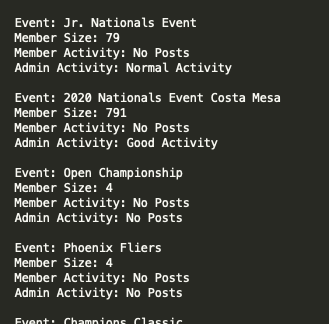

<!--
*** Thanks for checking out the Best-README-Template. If you have a suggestion
*** that would make this better, please fork the upComingEventResults_demo and create a pull request
*** or simply open an issue with the tag "enhancement".
*** Thanks again! Now go create something AMAZING! :D
***
***
***
*** To avoid retyping too much info. Do a search and replace for the following:
*** github_username, upComingEventResults_demo_name, twitter_handle, email, project_title, project_description
-->


<!-- PROJECT SHIELDS -->
<!--
*** I'm using markdown "reference style" links for readability.
*** Reference links are enclosed in brackets [ ] instead of parentheses ( ).
*** See the bottom of this document for the declaration of the reference variables
*** for contributors-url, forks-url, etc. This is an optional, concise syntax you may use.
*** https://www.markdownguide.org/basic-syntax/#reference-style-links
-->


<!-- PROJECT LOGO -->
<br />
<p align="center">
  <a href="https://github.com/MooseandSquvirrel/upComingEventsResults_demo">
    
  </a>

  <h3 align="center">Upcoming/Live Events Results</h3>

  <p align="center">
    A command-line program to automate the analysis of upcoming or live events' data.
    <br />
    <a href="https://github.com/MooseandSquvirrel/upComingEventResults_demo"><strong>Explore the docs »</strong></a>
    <br />
    <br />
    <a href="https://github.com/MooseandSquvirrel/upComingEventResults_demo/blob/master/file_eventsLive.txt">Example Raw Output</a>
  </p>
</p>


<!-- TABLE OF CONTENTS -->
<details open="open">
  <summary><h2 style="display: inline-block">Table of Contents</h2></summary>
  <ol>
    <li>
      <a href="#about-the-project">About The Project</a>
      <ul>
        <li><a href="#built-with">Built With</a></li>
      </ul>
    </li>
    <li>
      <a href="#getting-started">Getting Started</a>
      <ul>
        <li><a href="#prerequisites">Prerequisites</a></li>
        <li><a href="#installation">Installation</a></li>
      </ul>
    </li>
    <li><a href="#usage">Usage</a></li>
    <li><a href="#contact">Contact</a></li>
  </ol>
</details>


<!-- ABOUT THE PROJECT -->
## About The Project

<p align="center">
  <a href="https://github.com/MooseandSquvirrel/upComingEventsResults_demo">
    
  </a>
</p>

This command-line program was created for partnership and content
marketing teams at a start-up. The company's app was used by partner companies and organizations to organize and communicate around events they hosted or attended, and would collect data in the backend that was not easily accessible by non-dev teams.

This program was created to allow anyone to request specific partners upcoming or curretnly live events data. A user would enter a letter for a partner company and 
whether they wanted upcoming or live events and could even choose to ignore certain
events by entering them.

The program would then call the corresponding Trello Boards' API and collect the partners upcoming or current event cards (Trello column depending on which option was selected). Then that data was passed to the app's API and the event's data would be collected and printed to a simpled text file. Data included such info as: the name of the event, new users count, and even included output from a simple activity judging system. The system gauged the activity of the event's community based on posts, comments, and other quantifiable data.

### Built With

* [Python 3](https://www.python.org/)


<!-- GETTING STARTED -->
## Getting Started

This program was not meant for being open-sourced and therefore
is not for use in it's full functionality to be reproduced locally. This is because of the permissions required including:
staff/employee permissions, API scope and other necessary info not accessible to the public. The application's confidential information and files integral to its functioning have therefore been removed. 

If you'd like to download the code to have the template for a simple out of the box command-line interface for programs you're working on, or to just review the code, feel free to clone the repo!

### Prerequisites

* Make sure to have Python 3.

### Installation

1. Git clone.
   ```sh
   git clone https://github.com/MooseandSquvirrel/upComingEventResults_demo.git
   ```

<!-- USAGE EXAMPLES -->
## Usage

For creating command-line programs to make API calls inorder to automate data analysis.

_To view the code: [Documentation](https://github.com/MooseandSquvirrel/upComingEventResults_demo.git)_


<!-- CONTACT -->
## Contact

Andy Gardner - web.dev.bud1@gmail.com

Project Link: [https://github.com/MooseandSquvirrel/upComingEventsResults_demo](https://github.com/MooseandSquvirrel/upComingEventsResults_demo)


### Attribute

<div>Icons made by <a href="https://www.flaticon.com/authors/freepik" title="Freepik">Freepik</a> from <a href="https://www.flaticon.com/" title="Flaticon">www.flaticon.com</a></div>


<!-- MARKDOWN LINKS & IMAGES -->
<!-- https://www.markdownguide.org/basic-syntax/#reference-style-links -->
[contributors-shield]: https://img.shields.io/github/contributors/MooseandSquvirrel/upComingEventResults_demo.svg?style=for-the-badge
[contributors-url]: https://github.com/MooseandSquvirrel/upComingEventResults_demo/graphs/contributors
[forks-shield]: https://img.shields.io/github/forks/MooseandSquvirrel/upComingEventResults_demo.svg?style=for-the-badge
[forks-url]: https://github.com/MooseandSquvirrel/upComingEventResults_demo/network/members
[stars-shield]: https://img.shields.io/github/stars/MooseandSquvirrel/upComingEventResults_demo.svg?style=for-the-badge
[stars-url]: https://github.com/MooseandSquvirrel/upComingEventResults_demo/stargazers
[issues-shield]: https://img.shields.io/github/issues/MooseandSquvirrel/upComingEventResults_demo.svg?style=for-the-badge
[issues-url]: https://github.com/MooseandSquvirrel/upComingEventResults_demo/issues
[license-shield]: https://img.shields.io/github/license/MooseandSquvirrel/upComingEventResults_demo.svg?style=for-the-badge
[license-url]: https://github.com/MooseandSquvirrel/upComingEventResults_demo/blob/master/LICENSE.txt
[linkedin-shield]: https://img.shields.io/badge/-LinkedIn-black.svg?style=for-the-badge&logo=linkedin&colorB=555
[linkedin-url]: https://linkedin.com/in/MooseandSquvirrel

